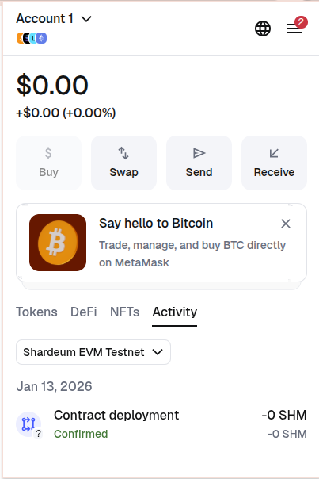
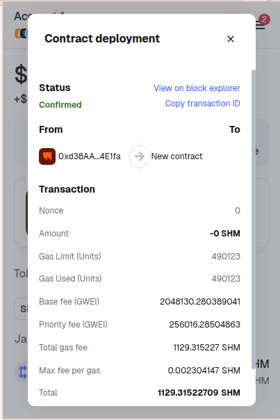

# VeriChain Network

VeriChain consists of a Hyperledger Fabric-based blockchain network designed for a pharmaceutical supply chain consortium. This project demonstrates a multi-org setup (Agri, Pharma, Distributor, Retailer, Regulators) with advanced **Private Data Collections (PDC)** for data isolation and **Zero-Knowledge Proofs (ZKP)** for privacy-preserving compliance verification.

Additionally, it features a **Public Notary Bridge** to **Shardeum**, allowing critical compliance milestones (like cold-chain integrity) to be publicly verifiable on a permissionless ledger without exposing sensitive private data.

---

## 🏗️ Architecture

### Network Topology
*   **Consensus**: Raft (EtcdRaft)
*   **Peers**: 4 Organizations:
    *   **Org1 (Agri)**: Raw material suppliers.
    *   **Org2 (Pharma)**: Manufacturers.
    *   **Org3 (Distributor)**: Logistics and Cold-chain handlers.
    *   **Org4 (Retailer)**: Pharmacies and Hospitals.
*   **Channel**: `verichain-channel`.

### Privacy & Security Model
1.  **Private Data Collections (PDC)**:
    *   **`AgriCollection`**: Visible only to Agri (Org1).
    *   **`PharmaCollection`**: Visible only to Pharma (Org2).
    *   Uses SideDBs to ensure competitors cannot see each other's raw data.
2.  **Zero-Knowledge Proofs (ZKP)**:
    *   Used to prove temperature compliance during transit ("Was the vaccine kept between 2-8°C?") without revealing the exact temperature logs.
3.  **Shardeum Bridge**:
    *   Acts as a "Public Notary".
    *   Stores the ZK-Proof Hash and verification result on the Shardeum testnet.
    *   Allows end-users (patients) to verify product safety via a public explorer/QR code.

---

## 📋 Prerequisites

Ensure your environment meets the following requirements before starting:

### Software
*   **Operating System**: Linux (Ubuntu 20.04+ / WSL2) or macOS.
*   **Docker**: v20.10+ (with Docker Compose v2.x).
*   **Node.js**: v18+ (Recommended for API and Chaincode).
*   **Hyperledger Fabric Binaries**: v2.5.x.

### Hardware Reference
*   Minimum: 8GB RAM, 2 CPU Cores (for running 4 peers + Orderer + DB + API).

---

## 🚀 Installation & Setup

### 1. Clone the Repository
```bash
git clone https://github.com/your-username/verichain-network.git
cd verichain-network
```

### 2. Bootstrap the Network
We use a custom orchestrator script `setup_verichain.sh` which handles cleanup, crypto generation, and channel creation for the 4-Org consortium.

```bash
./setup_verichain.sh
```
> **Note**: This process may take 2-5 minutes. It starts 4 Peers, 1 Orderer, and deploys the `basic` chaincode.

### 3. Start the Database (PostgreSQL)
VeriChain uses PostgreSQL for off-chain storage (inventory caching, ZK proofs).

```bash
docker-compose up -d postgres
```
*   **Credentials**: `user: verichain`, `password: verichain_secret`, `db: verichain`
*   **Port**: 5433 (Mapped to 5432 internally)

### 4. Setup the Backend API
The Node.js API serves as the middleware between the client and the Fabric network.

```bash
cd verichain-api
npm install
```

**Important**: If you have just restarted the network, you must restore the identity wallet:
```bash
node restore_identities.js
```

Start the API server:
```bash
npm start
```
*   **API URL**: `http://localhost:3000`

### 5. Setup the Frontend
The React application provides the dashboard for all organizations.

```bash
cd ../verichain-frontend
npm install
npm run dev
```
*   **Dashboard URL**: `http://localhost:5173`

---

## 🌉 Shardeum Public Notary Setup

To enable the "Public Verification" feature, you must deploy the Notary contract to the Shardeum Sphinx Testnet.

### 1. Deploy the Contract
1.  Locate the contract file: `shardeum/Notary.sol`.
2.  Open [Remix IDE](https://remix.ethereum.org/).
3.  Create a new file `Notary.sol` and paste the content.
4.  Compile the contract (Solidity 0.8.0+).
5.  In the **Deploy** tab, select **Injected Provider - MetaMask**.
6.  Connect MetaMask to **Shardeum Sphinx 1.X**.
7.  Deploy the contract and copy the **Deployed Contract Address**.

### 2. Configure the API
1.  Open `verichain-api/.env`.
2.  Update the following variables:

```env
SHARDEUM_RPC_URL=https://sphinx.shardeum.org/
SHARDEUM_PRIVATE_KEY=<YOUR_WALLET_PRIVATE_KEY>
SHARDEUM_CONTRACT_ADDRESS=<YOUR_DEPLOYED_CONTRACT_ADDRESS>
```
3.  Restart the API: `npm start`.

---

## 🕹️ Usage Workflow

### Step 1: Manufacturing (Pharma)
1.  Login to Frontend as **Pharma** (Org2).
2.  Go to **Create Asset**.
3.  Enter details (e.g., `VAX-001`, `Covid Vaccine`) and submit.
4.  *On Chain*: Asset created in `PharmaCollection`.

### Step 2: Transit & Simulation (Distributor)
1.  Login as **Distributor** (Org3).
2.  Go to **Dashboard** -> Select Asset -> **Simulate Transit**.
3.  The system simulates 30 temperature readings.
4.  **Generates ZK Proof**: Validates if all readings were between 2°C - 8°C.
5.  *On Chain*: Asset transferred to Distributor.

### Step 3: Public Notarization (Bridge)
1.  Once the ZK Proof is generated, click **"Notarize to Shardeum"**.
2.  The API sends the Proof Hash and Status to your Shardeum Smart Contract.
3.  A **QR Code** is generated linking to the Shardeum Explorer.

### Step 4: Final verification (Retailer/Public)
1.  Login as **Retailer** (Org4).
2.  Accept the shipment.
3.  Scan the QR code (or use the Public Verify link) to see the immutable record on Shardeum, proving the cold chain was maintained without revealing the raw temperature logs.

---

## 🛠️ Troubleshooting

### "Cryptogen not found"
Ensure Fabric binaries are in your PATH.
```bash
export PATH=$PWD/bin:$PATH
```

### "Connect ECONNREFUSED 127.0.0.1:5433"
PostgreSQL container is not running.
```bash
docker-compose up -d postgres
```

### "User not found in wallet"
The wallet directory is out of sync with the running blockchain.
```bash
cd verichain-api
rm -rf wallet
node restore_identities.js
```

### "Peer endorsements do not match"
This can happen if chaincode execution is non-deterministic (e.g., using `new Date()` inside chaincode). The current `basic` chaincode uses transaction timestamps to avoid this. If seen, ensure you aren't using random values in `putState`.

---

### Shardeum Contract Verification
The ZK-Proof Notary Contract is deployed on the Shardeum Sphinx Dappnet.
*   **Contract Address**: `0xd38AAAD7EDC17C3A46c3570A757fbfa13A04E1fa`
*   **Explorer Link**: [View on Shardeum Explorer](https://explorer-sphinx.shardeum.org/account/0xd38AAAD7EDC17C3A46c3570A757fbfa13A04E1fa)

## 🌐 Frontend Application (Powered by ThinkRoot)

The VeriChain frontend is a production-ready React application built using **[ThinkRoot](https://thinkroot.app/)**, a premier platform for rapid and scalable web application development. ThinkRoot is a key sponsor of this project, enabling us to deliver a high-quality user experience.

*   **Live Demo**: [https://verichain-v5mklw.thinkroot.app/](https://verichain-v5mklw.thinkroot.app/)
*   **Specification**: [Frontend Spec](docs/frontend_spec.md)

We leveraged ThinkRoot to rapidly prototype and deploy the interface for Pharma Manufacturers, Distributors, and Retailers.





## 📂 Project Structure

```
verichain-network/
├── chaincode/              # Smart Contracts (Node.js)
├── verichain-api/          # Backend API (Express + Fabric SDK)
├── verichain-frontend/     # React Dashboard
├── shardeum/               # Shardeum Solidity Contracts
├── scripts/                # Helper scripts (envVar, deployCC)
├── setup_verichain.sh      # Main Network Orchestrator
└── docker-compose.yml      # Container Definitions
```


---

## 🏆 Hackathon Recognition

VeriChain was developed at **Defy 2026** (VIT Chennai Blockchain Hackathon), where it emerged as a premier solution in a high-competition field.

* **Top Finalist**: Ranked among the overall top-performing teams.
* **1st Place Winner**: Secured the **ThinkRoot Special Category** award for excellence for the use of ThinkRoot in our devolopment.

**The Developers:**
* [Ammog Warrier](https://github.com/Ammog-Warrier)
* [Venkataraman T S K](https://github.com/TSKVenkat)
* [Kushvinth Madhavan](https://github.com/kushvinth)
* [Ashwin S](https://github.com/Ashwin-973)
